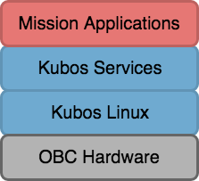

KubOS

=========

KubOS is an open-source software stack for satellites.

The KubOS system is designed to take care of every aspect of a satellite’s flight
software.

Rather than operating as a single, monolithic entity, KubOS is comprised of a series
of independent, yet interoperating components.

 

- Mission applications control and execute the logic necessary to accomplish mission goals
- Services expose hardware and system functionality with a controlled and uniform interface
- Kubos Linux provides the base operating system and the drivers needed to communicate with connected hardware devices

[Company website](https://www.kubos.com)

[Main Documentation Page](https://skcubesat.github.io/Software/docs)

# Getting Started

Here are some docs which we recommend you look at first when getting started with KubOS:

- [KubOS Design](https://skcubesat.github.io/Software/docs/kubos/kubos-design) - A high-level
  overview of what KubOS is and how it works
- [Getting Started with Local Dev Environment](https://skcubesat.github.io/Software/docs/kubos/getting-started) - 
  Docs for getting started with KubOS using a local dev environment of your choice
- [Getting Started with the Kubos SDK](https://skcubesat.github.io/Software/docs/kubos/sdk-docs) - 
  Docs for setting up an instance of the Kubos SDK as your development environemnt.
  Highly recommended for Windows users
- [New User Tutorials](https://skcubesat.github.io/Software/docs/kubos/tutorials) - Tutorials
  which will walk you through using all of the major components of KubOS

# Contributing to KubOS

Want to get your code to space? Become a contributor!

Check out our doc on [contributing to KubOS](https://skcubesat.github.io/Software/docs/kubos/contributing/contribution-process) 
and come talk to us on [Slack](https://slack.kubos.co/) to join our community. 

Or, if you're just looking to give some feedback, 
submit an [issue](https://github.com/kubos/kubos/issues) with your feature requests or bug reports! 

# Repo Components

These are the important folders in this repo:

- apis - Contains all of our [hardware APIs](https://skcubesat.github.io/Software/docs/kubos/deep-dive/apis/device-api)
  as well as our [application APIs](https://skcubesat.github.io/Software/docs/kubos/ecosystem/apps/app-guide)
- clients - Contains client programs which can be used locally to communicate with the
  corresponding service on a remote target
- docs - Contains all of the raw doc files used to generate our [documentation](https://skcubesat.github.io/Software/docs)
- examples - Various example KubOS projects
- hal - A collection of [hardware interface abstractions](https://skcubesat.github.io/Software/docs/kubos/deep-dive/apis/kubos-hal)
- libs - Helper libraries used when building [Kubos services](https://skcubesat.github.io/Software/docs/kubos/ecosystem#services)
- services - Contains all of the Kubos [core services](https://skcubesat.github.io/Software/docs/kubos/ecosystem/services/core-services)
  and [hardware services](https://skcubesat.github.io/Software/docs/kubos/ecosystem/services/hardware-services)

# Related Repos

- [kubos-linux-build](https://github.com/kubos/kubos-linux-build) - Repo used for
  configuring and building KubOS images
- [cargo-kubos](https://github.com/kubos/cargo-kubos) - Repo for a Cargo subcommand
  which will assist with cross-compiling Rust projects for KubOS
- [kubos-vagrant](https://github.com/kubos/kubos-vagrant) - Repo used to build the
  Kubos SDK
